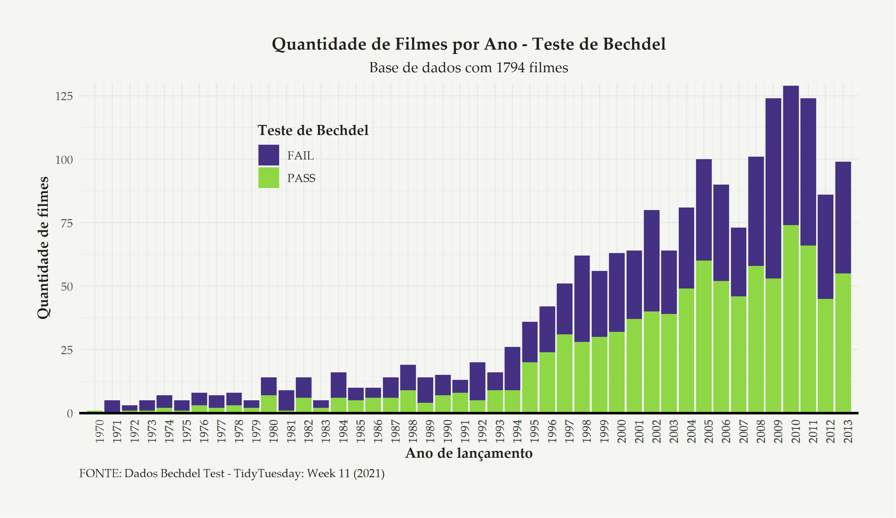
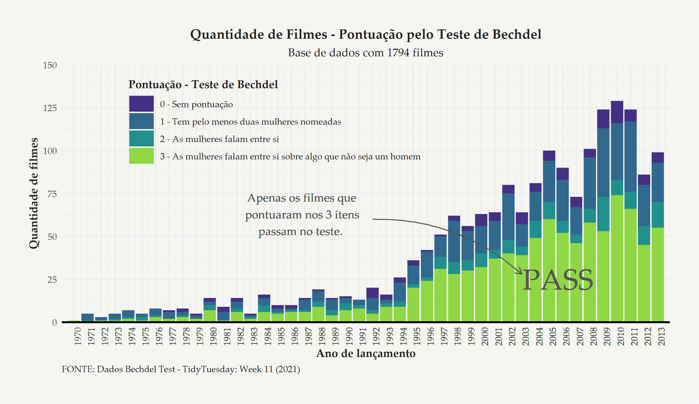
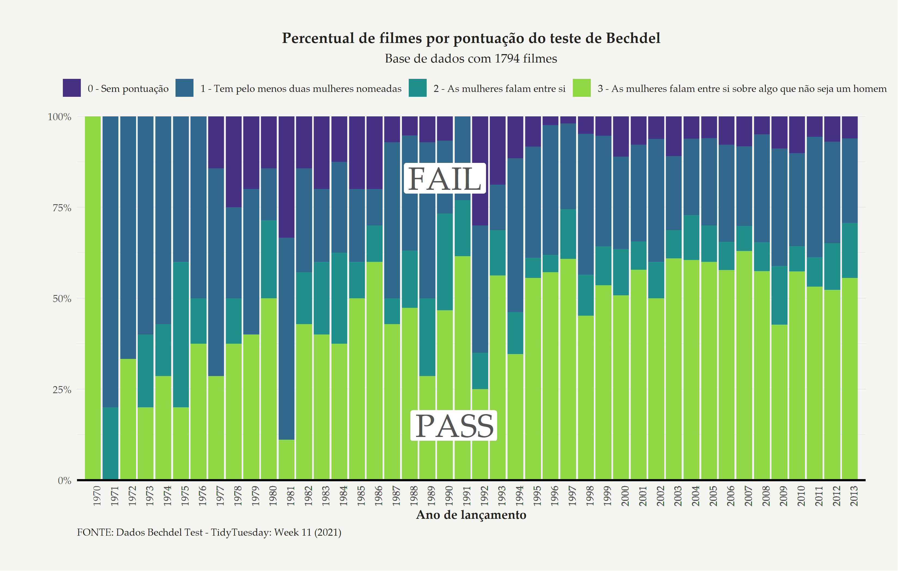
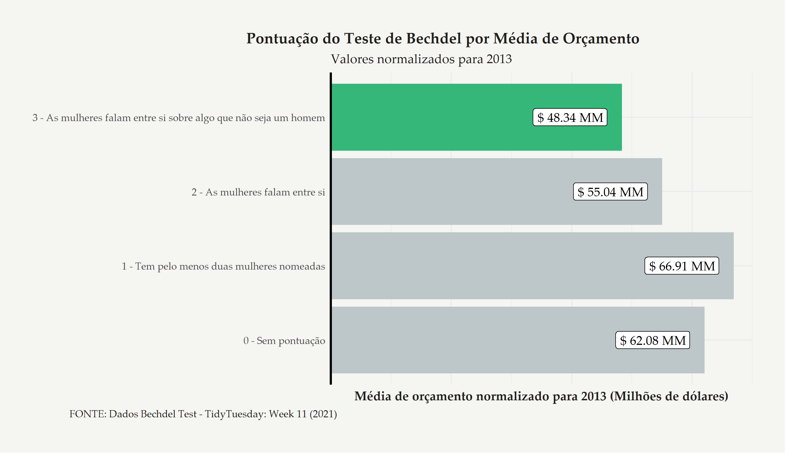
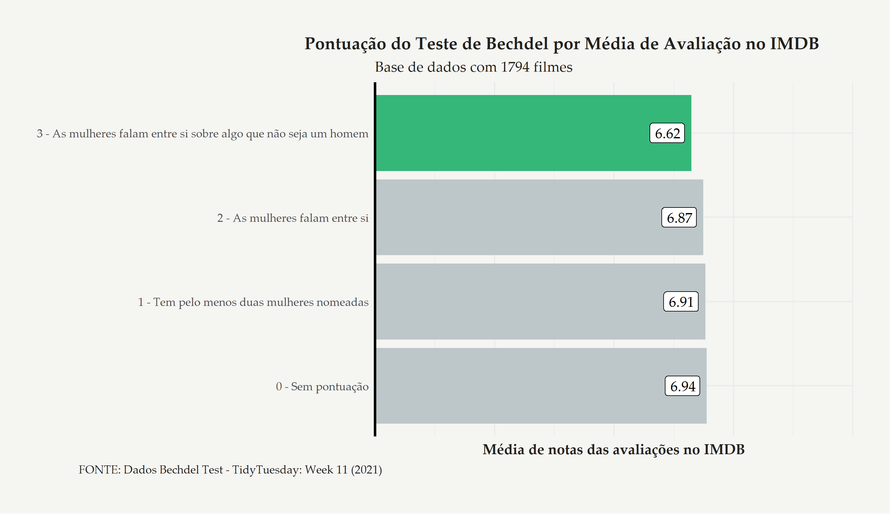

```{r xaringan-themer, include=FALSE, warning=FALSE}
library(xaringanthemer)
style_xaringan(
  header_h1_font_size = "22pt",
  header_h2_font_size = "18pt",
  header_h3_font_size = "16pt",
  header_color = "#058962 ",
  background_color = "#F5F5F2"
    
)

# style_duo_accent(
#   primary_color = "#FFAEBC",
#   secondary_color = "#A0E7E5",
#   inverse_header_color = "#e91e63",
#   title_slide_text_color = "#167ac6",
# )

# efeturar o download da biblioteca lib para rodar a apresentação sem internet
#::summon_remark()

# para visualizar os tema disponíveis
#names(xaringan:::list_css())

# atalho legais para a apresentação:
# F = Modo fullscreen
# P = Modo de apresentação

```


# Introdução
```{r include=FALSE}
# carregar pipe
'%>%' <- magrittr::`%>%`

# Importar base -----------------------------------------------------------
movies_rating <- readr::read_rds("../R/2021-04-09_movies_rating_bechdel_test.rds")
raw_bechdel <- readr::read_rds("../R/2021-04-11_raw_bechdel_with_legends.rds")
errors <- readr::read_rds("../R/2021-04-12_table_with_erros.rds")
correct <- readr::read_rds("../R/2021-04-12_table_correct.rds")

```

Essa análise tem como objetivo atender ao requisito de um projeto final para o curso "Relatórios e Visualização de Dados" da Curso-R.

O objetivo é desenvolver uma análise onde o aluno possa demonstrar os conhecimentos obtidos em visualização de dados durante o curso.

Para isso, a recomendação foi utilizar uma base de dados do [TidyTuesday](https://github.com/rfordatascience/tidytuesday), um evento semanal da comundidade R, onde é liberado uma base de dados para engajar os usuários em análise e visualização.

A base escolhida foi a do Teste de Bechdel, referente à semana 11 de 2021 do TidyTuesday.


---
# Premissas
O pacote do TidyTuesday fornece duas bases para análise, a primeira com dados resultantes do teste, englobando um histórico de 1970 a 2020, onde consta apenas o nome do filme com informações do teste.

--
- Base 1 - raw_bechdel

```{r echo=FALSE}

raw_bechdel <- tibble::tribble(
  ~variable,      ~class,                                                                                                                                  ~description,
     "year",   "integer",                                                                                                                             "Year of release",
       "id",   "integer",                                                                                                                                  "ID of film",
  "imdb_id", "character",                                                                                                                                     "IMDB ID",
    "title", "character",                                                                                                                               "Title of film",
   "rating",   "integer", "Rating (0-3), 0 = unscored, 1. It has to have at least two [named] women in it, 2. Who talk to each other, 3. About something besides a man"
  )

raw_bechdel %>% 
  knitr::kable(format = "html")
```


---
# Premissas
Já a segunda base possui informações mais completas sobre os filmes, com 34 variáveis diferentes, podendo aumentar a gama de análises, porém com um período menor (apenas até 2013). A tabela a seguir mostra as primeiras 8 colunas dessa base:

--
- Base 2 - movies

```{r echo=FALSE}
movies <- tibble::tribble(
        ~variable,      ~class,                             ~description,
           "year",    "double",                                   "Year",
           "imdb", "character",                                   "IMDB",
          "title", "character",                         "Title of movie",
           "test", "character",                   "Bechdel Test outcome",
     "clean_test", "character",                   "Bechdel Test cleaned",
         "binary", "character",            "Binary pass/fail of bechdel",
         "budget",    "double",              "Budget as of release year",
       "domgross", "character",         "Domestic gross in release year",
       "intgross", "character",    "International gross in release year",
           "code", "character",                                   "Code",
    "budget_2013",    "double",              "Budget normalized to 2013",
  "domgross_2013", "character",      "Domestic gross normalized to 2013",
  "intgross_2013", "character", "International gross normalized to 2013",
    "period_code",    "double",                            "Period code",
    "decade_code",    "double",                            "Decade Code",
        "imdb_id", "character",                                "IMDB ID",
           "plot", "character",                          "Plot of movie",
          "rated", "character",                        "Rating of movie",
       "response", "character",                              "Response?",
       "language", "character",                       "Language of film",
        "country", "character",                    "Country produced in",
         "writer", "character",                         "Writer of film",
      "metascore",    "double",               "Metascore rating (0-100)",
    "imdb_rating",    "double",                       "IMDB Rating 0-10",
       "director", "character",                      "Director of movie",
       "released", "character",                          "Released date",
         "actors", "character",                                 "Actors",
          "genre", "character",                                  "Genre",
         "awards", "character",                                 "Awards",
        "runtime", "character",                                "Runtime",
           "type", "character",                           "Type of film",
         "poster", "character",                           "Poster image",
     "imdb_votes", "character",                             "IMDB Votes",
          "error", "character",                                 "Error?"
  )


head(movies, n = 8) %>% 
  knitr::kable(format = "html")

```


---

# Premissas

Para facilitar o processo, foi feito um *join* entre as duas bases pela coluna `imdb_id` presente em ambas. Assim, foi possível colocar na base `movies` alguns detalhes adicionais do teste de Bechdel, como a pontuação obtida pelo filme.

Entretanto, foi encontrado um problema com o teste em alguns filmes, pois, seguindo a regra, somente os filmes com pontuação 3 poderiam **passar** (PASS) no teste, só que não foi isso que uma exploração simples da base resultou.

A tabela que resume a situação encontrada pode ser verificada no próximo slide.

---
# Tabela com erros

```{r echo=FALSE, fig.align='center'}
# errors %>% 
#   kableExtra::kable(format = "html")


# como centralizar os dados dentro da tabela?
errors %>%
  DT::datatable(
    #width = "600px",
    fillContainer = TRUE,
    options = list(
      pageLength = 10,
      scrollY = "350px",
      columnDefs = list(list(
        className = 'dt-center', targets = "_all"
      ))
    )
  ) %>%
  DT::formatStyle(columns = c("rating", "binary", "clean_test", "n"),
                  textAlign = 'center')
```

--- 

---

# Ajustes
Como consequência do problema encontrado na base anterior, foi utilizado como premissa as seguintes condições da coluna `clean_test` para ajuste:

- Tudo que estava como `dubious` e `ok`na coluna `clean_test` foi classificado como _rating_ `3` e resultado do teste para `PASS`.
- Tudo que estava como `men` na coluna `clean_test` foi classificado como _rating_ `2` e o resultado do teste para `FAIL`.
- Tudo que estava como `notalk` na coluna `clean_test` foi classificado como _rating_ `1` e o resultado do teste para `FAIL`.
- Tudo que estava como `nowomen` na coluna `clean_test` foi classificado como _rating_ `0` e o resultado do teste para `FAIL`.

Com isso, foi possível obter uma base consistente, que pode ser verificada no próximo slide.

---
# Ajustes
### Resultado da base ajustada

```{r echo=FALSE, paged.print=TRUE}
correct %>% 
  kableExtra::kable(format = "html")
```


---

# Exploração e Visualização
Uma vez ajustada a base, foi gerado cinco gráficos distintos visando aplicar o conhecimento obtido no curso e possivelmente responder alguns questionamentos levantados, como:

- Dado o histórico de filmes, quais são os anos onde o teste apresentou maior "FALHA" em valores absolutos.
- Dado o histórico de filmes, como é a divisão de pontuação entre eles em valores absolutos?
- Dado o histórico de filmes, como é a divisão de pontuação entre eles em valores relativos?
- Dado o orçamento do filme normalizado para 2013, qual a média de orçamento para as diferentes pontuações do teste de Bechdel?
- Dado às notas avaliativas da base IMDB, qual a média de notas para as diferentes pontuações do teste de Bechdel?

Os gráficos a seguir tentam responder esses 5 pontos.


---

# Histórico - Anos que apresentaram "FAIL"e "PASS"
```{r echo=FALSE, message=FALSE, warning=FALSE, fig.align='center', out.width="90%", dpi=300}

```


---
# Histórico - Pontuação do Teste em números absolutos
```{r echo=FALSE, fig.align='center', out.width="90%", dpi=300}

```


---
# Histórico - Pontuação do Teste em números relativos
```{r echo=FALSE, fig.align='center', out.width="80%", dpi=300}

```


---
# Orçamento - Média de orçamento por pontuação
```{r echo=FALSE, fig.align='center', out.width="85%", dpi=300}

```


---
# Avaliação - Média de notas avaliativas no IMDB por pontuação
```{r echo=FALSE, fig.align='center', out.width="85%", dpi=300}

```


---
# Conclusões
Pode-se perceber que ainda tem um grande caminho de inclusão das mulheres dentro do mundo cinematográfico, onde somente nos últimos anos os filmes tendem a passar no teste.

Sendo que, em matéria de média de orçamento e nota avaliativa, os filmes que passam no teste estão em último nessas categorias.

É preciso repensar o modo como consumimos entretenimento, para mudar a indústria aos poucos.

---
class: center middle, inverse

Obrigado por ler esse material até aqui!


